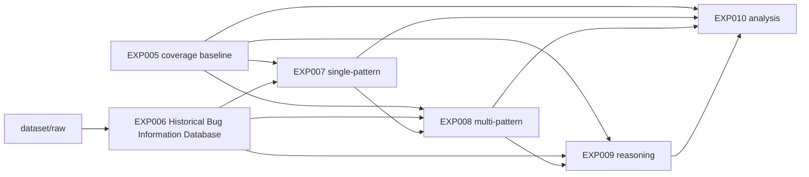

# Experiment Dependencies

The formal experiment line starts with EXP005. EXP001-EXP004 are retained only
as early exploration and reproduction notes.



At the data-flow level:

```text
dataset/raw
  -> EXP006
  -> EXP007 / EXP008 / EXP009
  -> EXP010

EXP005 baseline
  -> EXP007 / EXP008 / EXP009 / EXP010
```

EXP006 transforms raw historical issue material into structured reports,
patterns, and knowledge. EXP007-EXP009 consume those assets using progressively
richer prompting strategies. EXP010 compares their migrated results against the
EXP005 baseline.
